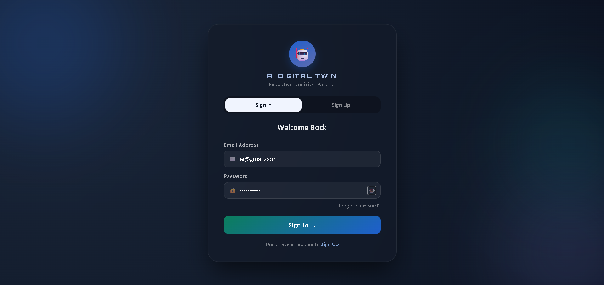
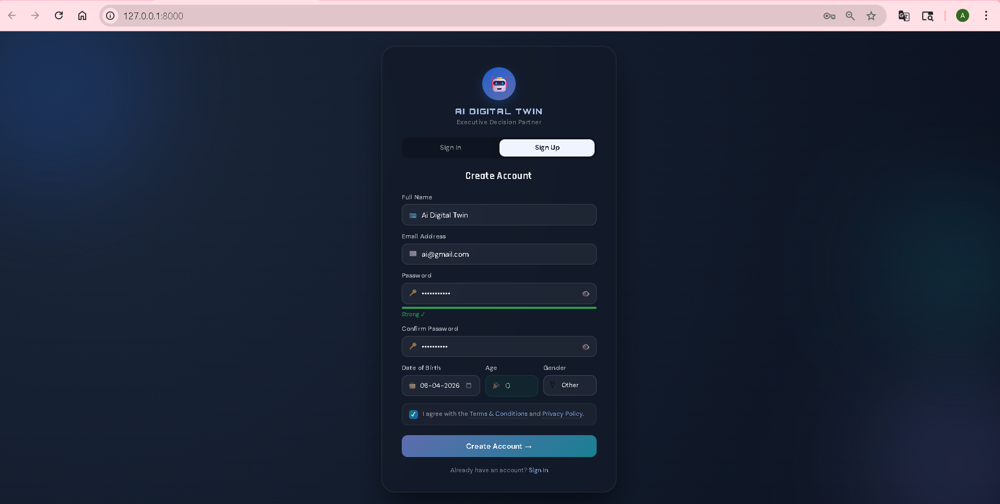
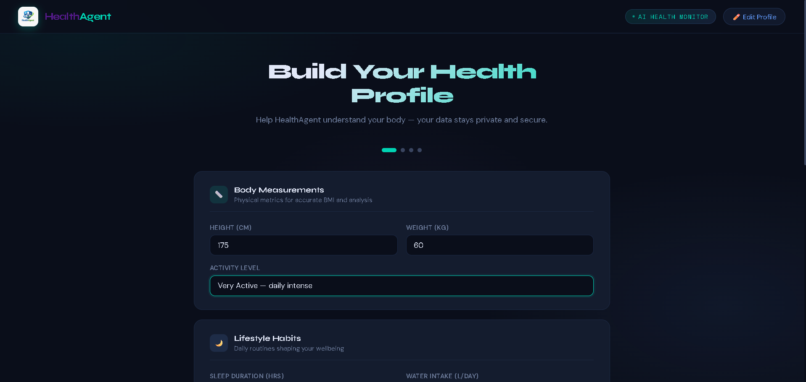
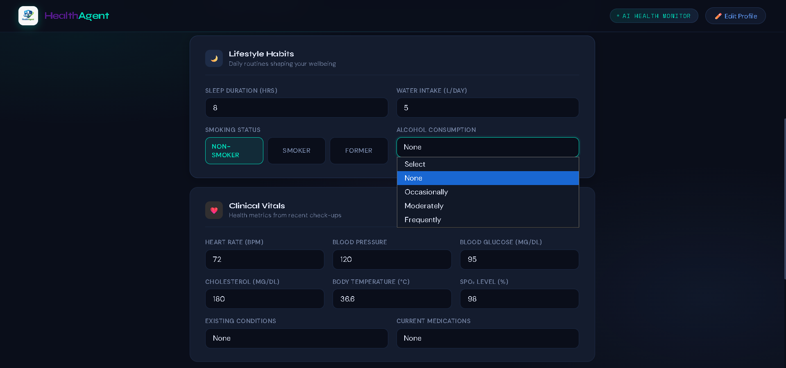
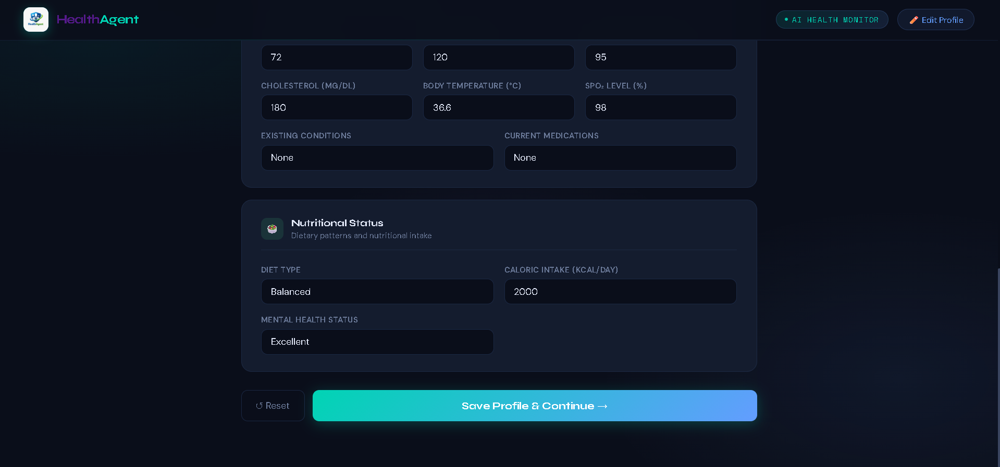
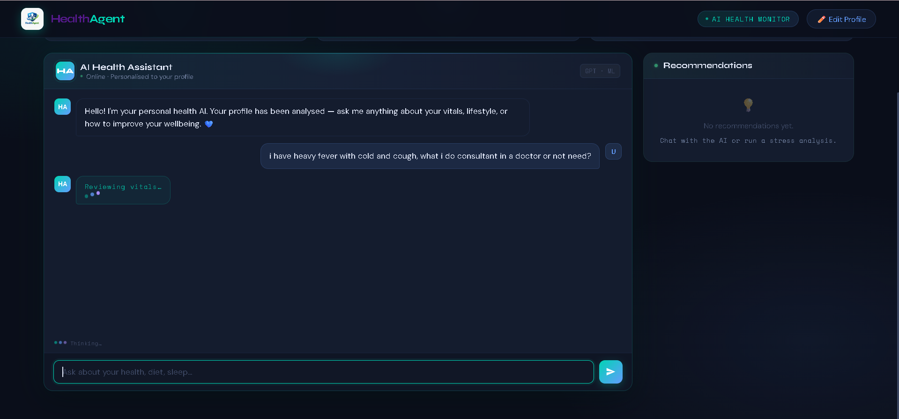
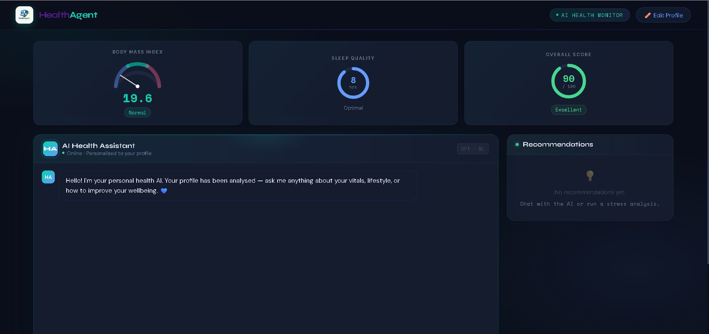

# 🏥 HealthAgent - Intelligent Decision & Recommendation System
Health Agent is an AI-powered web application that helps users analyze basic health indicators and receive **personalized health insights and recommendations**. The system collects user health data, computes metrics like BMI, sleep quality, and lifestyle scores, and uses an **intelligent decision agent** to generate health advice.

---

# 🚀 Features

- ✅ Personalized Recommendations
- ✅ Health Profile Management
- ✅ Real-time Dashboard (BMI, Sleep, Score)
- ✅ AI Health Decision Agent

---

# 🛠️ Tech Stack

- Backend: Django
- Frontend: HTML, CSS, JavaScript
- LLM: Ollama
- Database: PostgreSQL

---

# 📦 Project Setup

## 1️⃣ Clone Repository
```
git clone https://github.com/asqar268008/HealthAgent.git
```
```
cd health-agent
```

---

## 2️⃣ Create Virtual Environment (.venv)

🔹 Windows
```
python -m venv .venv
```
```
.venv\Scripts\activate
```

🔹 Mac/Linux
```
python3 -m venv .venv
```
```
source .venv/bin/activate
```

---

## 3️⃣ Install Dependencies
```
pip install -r requirements.txt
```

---

## 4️⃣ Environment Variables (.env)

Create a .env file in root directory:
```
POSTGRESQL_PASSWORD = your_password
DJANGO_SECRET_KEY = your_django_secret_key
```

---

## 5️⃣ PostgreSQL Setup

🔹 Create Database

Open PostgreSQL:
```
CREATE DATABASE agentdb;
```

---

## 6️⃣ Apply Migrations
```
python manage.py makemigrations
```
```
python manage.py migrate
```

---

## 7️⃣ Run Server
```
python manage.py runserver
```

Open in browser:
```
http://127.0.0.1:8000
```

---

# 📊 Output

* Decision Making
* Recommendations
  
---

# 📸 Application Preview
<div align="center"> 
  
  
  
  
  
  
  
</div>

---

# 📌 Future Improvements

- 🔹 Deep Learning Model
- 🔹 Wearable Device Integration
- 🔹 Mobile App Version
- 🔹 Real-time Monitoring

---

# 🤝 Contributing

Feel free to fork and improve this project!

---

# 📬 Contact

If you have suggestions or feedback, feel free to connect 🚀
